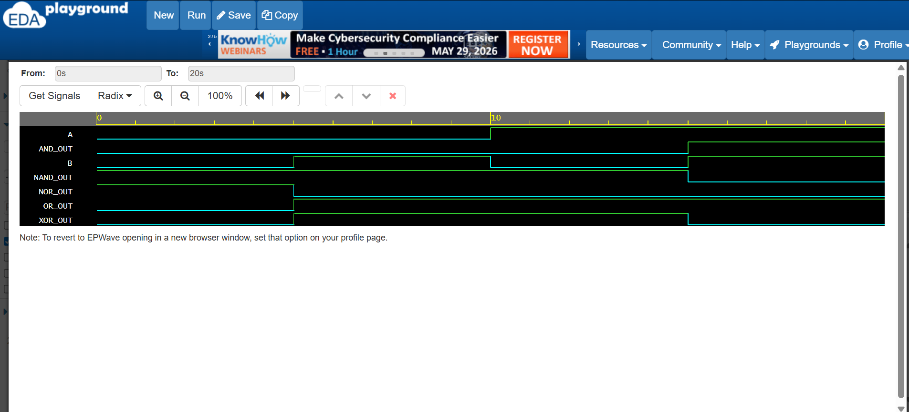
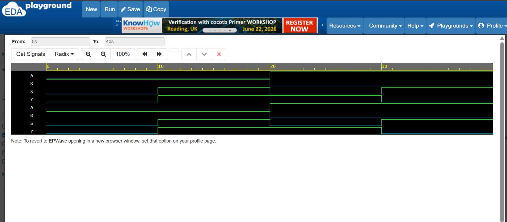
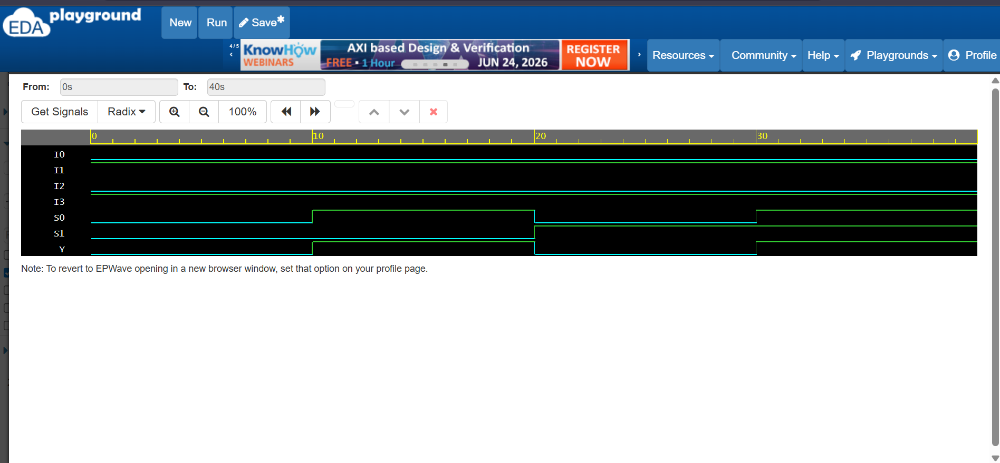
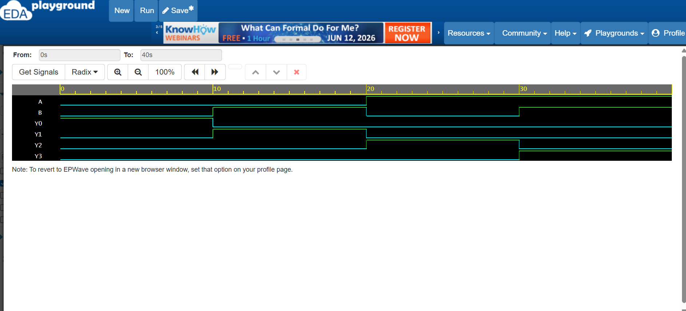
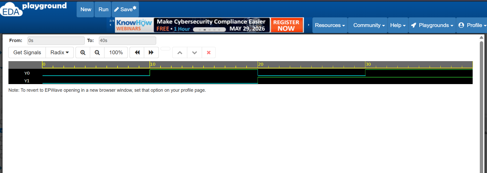
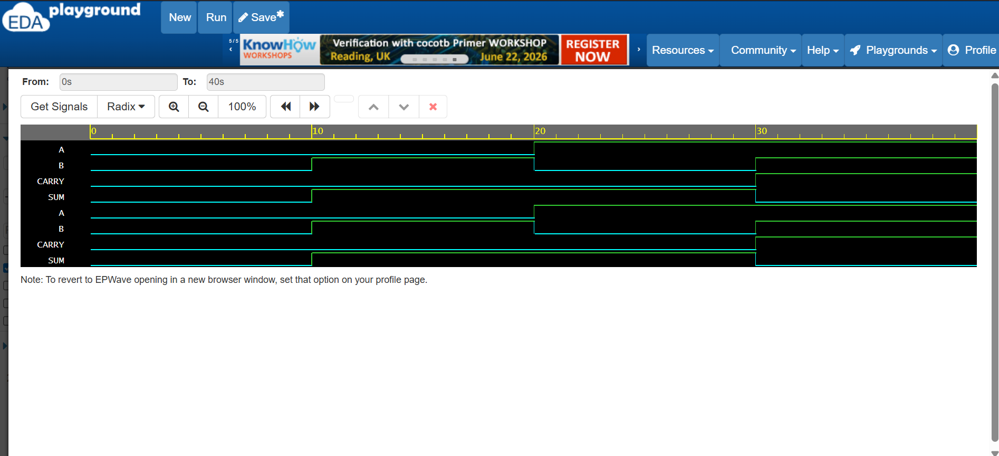
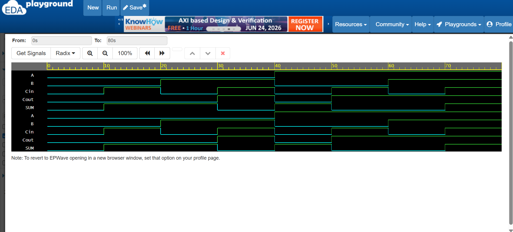

# 🔷 Verilog Fundamentals

## 📖 Overview

This repository contains a collection of fundamental Digital Design projects implemented using Verilog HDL.

The projects were designed, simulated, and verified using EDA Playground and EPWave.

The objective of this repository is to build a strong foundation in Verilog programming and Digital Logic Design through hands-on implementation of commonly used combinational circuits.

---

## 🎯 Learning Objectives

* Understand Verilog HDL syntax and structure
* Design combinational logic circuits
* Develop testbenches for verification
* Analyze simulation waveforms
* Build a strong foundation for FPGA and VLSI design

---

## 🛠️ Tools Used

* Verilog HDL
* EDA Playground
* EPWave
* GitHub

---

# 📸 Simulation Results

## 1️⃣ Basic Logic Gates

### Implemented Gates

* AND Gate
* OR Gate
* XOR Gate
* NAND Gate
* NOR Gate

  

The waveform verifies the correct functionality of all basic logic gates.

---

## 2️⃣ 2:1 Multiplexer (MUX)

### Features

* Data selection using one select line
* Conditional operator implementation

  

The simulation confirms correct data routing based on the select signal.

---

## 3️⃣ 4:1 Multiplexer (MUX)

### Features

* Selection among four inputs
* Two-bit select line control

  

The waveform demonstrates proper output selection for all input combinations.

---

## 4️⃣ 2-to-4 Decoder

### Features

* Binary input decoding
* One-hot output generation

  

The decoder correctly activates one output line corresponding to the input combination.

---

## 5️⃣ 4-to-2 Encoder

### Features

* Active input encoding
* Binary output generation

  

The waveform verifies the conversion of active input lines into binary encoded outputs.

---

## 6️⃣ Half Adder

### Features

* Addition of two binary bits
* SUM generation
* CARRY generation

  

The simulation validates correct SUM and CARRY outputs for all input combinations.

---

## 7️⃣ Full Adder

### Features

* Addition of two binary bits and carry input
* SUM output
* CARRY output

  

The waveform confirms accurate arithmetic operation with carry propagation.

---

## 📂 Repository Contents

Each project contains:

* Verilog Design File (.v)
* Testbench File (_tb.v)
* Simulation Waveform (.png)

All modules were independently verified using simulation-based testing.

---

## 🎓 Learning Outcomes

Through these projects, I gained practical experience in:

* Verilog HDL Programming
* Digital Logic Design
* Combinational Circuit Implementation
* Testbench Development
* Simulation and Verification
* Waveform Analysis
* Hardware Modeling
* FPGA Design Fundamentals

---

## 🚀 Future Enhancements

This repository will be expanded with:

* D Flip-Flop
* JK Flip-Flop
* T Flip-Flop
* Shift Registers
* Counters
* Finite State Machines (FSMs)
* ALU Design
* UART Communication
* Traffic Light Controller
* FPGA Mini Projects

---

## 👩‍💻 Author

**Aneesa Pattan**

Electronics and Communication Engineering (ECE) Student

Interested in:

* Verilog HDL
* VLSI Design
* FPGA Development
* Digital Electronics
* Embedded Systems
* IoT Projects

⭐ If you found this repository useful, consider giving it a star.
